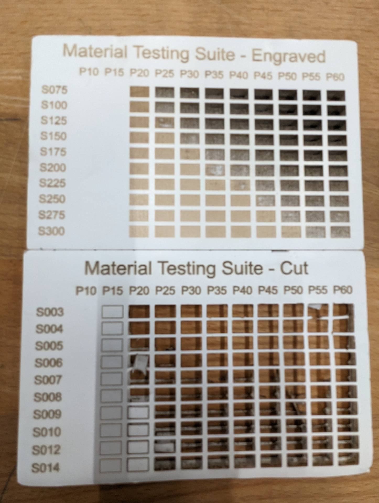

# Introduction_Laser_Beambox

Small introduction on how to use the Beambox pro laser cutter in french. Checkout the [english version](https://github.com/b2renger/Introduction_Laser_Beambox/tree/english)

La machine se trouve dans l'atelier bois.

[fiche produit](https://www.fluxlasers.com/beambox-pro.html)

**[Logiciel gratuit pour préparer vos fichiers](https://www.fluxlasers.com/service/downloads/)** : préférez la version stable en téléchargement.

La beambox pro est une découpeuse laser de table qui est destinée à être utilisée à terme en autonomie si les quelques règles décrites ci-après sont suivies.

**Pour une première utilisation et en cas de doute : demandez l'avis d'un membre de l'atelier maquette ou de l'atelier numérique**

Elle dispose d'une surface de travail de **600 x 375 mm** et en autonomie elle est destinée à procéder à des gravures et découpes de : 
- contreplaqué / mdf - 3mm
- acrylique - 3mm
- carton plume - 3mm
- carton bois - 3mm

En dehors de ces matériaux (y compris à des épaisseurs différentes) vous demander de l'aide à un membre de l'atelier maquette ou de l'atelier numérique.

Pour information, vous pouvez trouver ci-dessous le tableau des capacités de la machine en terme de matériaux en découpe et gravure.

Vous pouvez trouver la documentation complète du fabriquant à **[cette adresse](https://support.flux3dp.com/hc/en-us/categories/360000121176-Beambox-Guide)**

Ou en **[pdf](lasets_assets/beambox-manual.pdf)**

# Le workflow
Dans un premier temps vous devez créer vos tracés avec un outil de dessin vectoriel de votre choix (inkscape, illustrator ou autre) - instructions ci-dessous.

Si vous souhaitez un format de découpe / gravure supérieur à celui supporté par la beambox, vous devez envoyer votre fichier à l'atelier maquette *atelier@lecolededesign.com* qui le traitera pour vous. Sinon vous pouvez continuer.

Ensuite vous devez utiliser le logiciel de la machine BeamStudio et importer vos tracés. Vous pourrez alors choisir quels tracés vous souhaitez graver et quels tracés vous souhaiter couper.

Une fois votre projet beamstudio sauvegardé vous pouvez le transférer sur l'ordinateur connecté à la laser pour l'ouvrir et lancer la découpe sur la machine. **Pour une première utilisation de la machine demandez de l'aide**

## Les tracés

Dans un souci de compatibilité avec l'autre découpe laser il est préférable de suivre la procédure de l'atelier maquette. Cette procédure est valable quelquesoit la machine que vous utilisez.

Préparez vos fichier sur illustrator

- Dimension de page au format de la machine (500 x 350 mm)
- Passer en mode RVG : Fichier -> Mode Colorimétrique du document -> Coueurs RVB
- Dessiner le contour de la zone de travail avec un tracé d'épaisseur de contour de 0.01 en couleur JAUNE (255,255,0) => optionnel pour la beambox pro
- Positionner vos découpes ou gravures dans cette zone
- Tracer vos vos motifs :
    - Découpe en ROUGE (255,0,0) : fond vide / contour rouge / épaisseur de contour 0.01pt
    - Gravure en NOIR (0,0,0) : fond vide / contour ou aplat noir
    - Positionnement en JAUNE (255,255,0) : fond vide / contour jaune => optionnel pour la beambox.
- **Optimisez votre fichier** pour éviter le gaspillage et limiter la durée des découpes
    - placer vos découpe dans l'angle haut à gauche de la zone de travail
    - regrouper au maximum les tracés, ne laissez que 1mm entre chaque motif.
- Enregistrer au format **.pdf** (Acrobat 8) - pour la beambox vous pouvez aussi enregistrer au format **.svg** particulièrement si l'import pdf ne fonctionne pas.

## Le Logiciel (valable uniquement pour la beambox)

Le logiciel est très simple d'utilisation mais vous pourrez trouver un guide **[ici](https://support.flux3dp.com/hc/en-us/categories/360000121176-Beambox-Guide)**

Notez bien que vous pouvez aussi suivre la procédure de l'atelier maquette.

L'interface ressemble à ceci : 

Vous pouvez importer vos fichiers par glisser / déposer. 

Veillez bien à régler la taille de la zone de travail, dans le menu **Edit** -> **Document and settings** et bien sélectionner **Beambox pro** dans le menu **working area**

Si vous avez plusieurs couleurs de tracés pour découpe et gravue à l'import choisissez **"color"** - chaque couleur de tracé sera alors importé dans un calque. Sinon choisissez **"single layer"** afin d'avoir tout vos tracés importés dans un seul calque.

Vous pouvez donc agencer vos tracés et ajouter certains éléments si vous le souhaitez (images, textes etc.).

Dans le coin supérieur droit vous avez un menu contextuel qui vous permet soit d'ajuster les propriétés de vos tracés 

Soit de travailler sur vos calques :

Pour chaque calque vous avez alors la possibilité de régler les paramètres du laser. Il est donc possible d'avoir un calque pour la découpe (layer 1 en noir) et un calque pour la gravure (layer 2 en bleu).

Les paramètres disponibles sont des presets réalisées par l'équipe, si jamais vous souhaitez les modifier vous devez nous en parler avant.

## Chargement des matériaux et lancement de la découpe

Une fois la machine démarrée et votre fichier chargé sur l'ordinateur à disposition. Vous pouvez cliquer sur le bouton pour démarrer la découpe :

Au momment ou vous cliquez sur le triangle la fenêtre ci-dessous s'ouvre et vous devez ajuster le point de départ de votre découpe : il s'agit d'aligner l'origine sur laser sur le coin supérieur gauche de votre matériau.

Cliquez sur la petite cible :

Vous pouvez alors déplacer les lignes vertes horizontales et verticales pour qu'elles s'alignent avec le coin supérieur gauche.

 

## Tests matériaux

Vous pouvez trouver une boite contenant tous les tests de matériaux à l'atelier maquette à côté de la machine.

### PMMA
 

### Carton bois
 

### Carton plume
 

### Carton gris
 

### MDF
 

## Ressources tracés

[collection de ressources](https://leresteux.net/creation-de-boite-a-la-decoupeuse-laser/)

[générateurs de boites](https://www.festi.info/boxes.py/)

[fichiers svg pour les charnières vivantes](https://github.com/b2renger/Introduction_Laser_Beambox/releases/tag/1.1)

[fichiers ai pour les charnières vivantes](https://github.com/b2renger/Introduction_Laser_Beambox/releases/tag/1.0)

## Comment ça marche cette machine ?

[Pour aller plus loin sur la compréhension de la machine](https://edutechwiki.unige.ch/fr/D%C3%A9coupe_et_gravure_laser)

