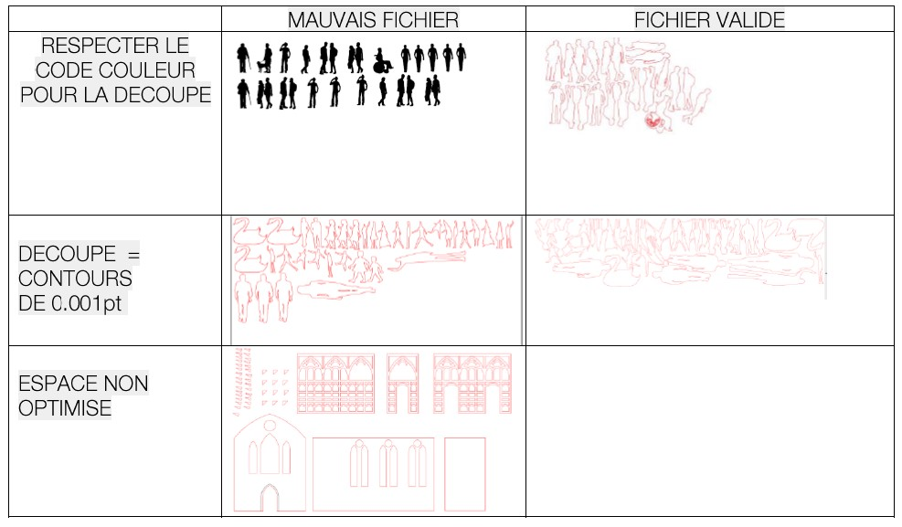

# Introduction_Laser_Beambox

Small introduction on how to use the Beambox pro laser cutter.

La machine se trouve dans l'atelier bois.

[fiche produit](https://www.fluxlasers.com/beambox-pro.html)

**[Logiciel gratuit pour préparer vos fichiers](https://www.fluxlasers.com/service/downloads/)** : préférez la version stable en téléchargement.

La beambox pro est une découpeuse laser de table qui est destinée à être utilisée à terme en autonomie si les quelques règles décrites ci-après sont suivies.

**Pour une première utilisation et en cas de doute : demandez l'avis d'un membre de l'atelier maquette ou de l'atelier numérique **

Elle dispose d'une surface de travail de **600 x 375 mm** et en autonomie elle est destinée à procéder à des gravures et découpes de : 
- contreplaqué / mdf - 3mm
- acrylique - 3mm
- carton plume - 3mm
- carton bois - 3mm

En dehors de ces matériaux (y compris à des épaisseurs différentes) vous demander de l'aide à un membre de l'atelier maquette ou de l'atelier numérique.

Pour information, vous pouvez trouver ci-dessous le tableau des capacités de la machine en terme de matériaux en découpe et gravure.

Vous pouvez trouver la documentation complète du fabriquant à **[cette adresse](https://support.flux3dp.com/hc/en-us/categories/360000121176-Beambox-Guide)**

Ou en **[pdf](lasets_assets/beambox-manual.pdf)**

## Le workflow
Dans un premier temps vous devez créer vos tracés avec un outil de dessin vectoriel de votre chois (inkscape, illustrator ou autre).

Ensuite vous devez utiliser le logiciel de la machine BeamStudio et importer vos tracés. Vous pourrez alors choisir quels tracés vous souhaitez graver et quels tracés vous souhaiter couper.

Une fois votre projet beamstudio sauvegardé vous pouvez le transférer sur l'ordinateur connecté à la laser pour l'ouvrir et lancer la découpe sur la machine.

### Les tracés

Dans un souci de compatibilité avec l'autre découpe laser il est préférable de suivre la procédure de l'atelier maquette.

Préparez vos fichier sur illustrator

- Dimension de page au format de la machine (500 x 350 mm)
- Passer en mode RVG : Fichier -> Mode Colorimétrique du document -> Coueurs RVB
- Dessiner le contour de la zone de travail avec un tracé d'épaisseur de contour de 0.01 en couleur JAUNE (255,255,0) => optionnel pour la beambox pro
- Positionner vos découpes ou gravures dans cette zone
- Tracer vos vos motifs :
    - Découpe en ROUGE (255,0,0) : fond vide / contour rouge / épaisseur de contour 0.01pt
    - Gravure en NOIR (0,0,0) : fond vide / contour ou aplat noir
    - Positionnement en JAUNE (255,255,0) : fond vide / contour jaune => optionnel pour la beambox.
- **Optimisez votre fichier** pour éviter le gaspillage et limiter la durée des découpes
    - placer vos découpe dans l'angle haut à gauche de la zone de travail
    - regrouper au maximum les tracés, ne laissez que 1mm entre chaque motif.
- Enregistrer au format **.pdf** (Acrobat 8) (pour la beambox vous pouvez aussi enregistrer au format svg).

### Le Logiciel

Le logiciel est très simple d'utilisation mais vous pourrez trouver un guide **[ici](https://support.flux3dp.com/hc/en-us/categories/360000121176-Beambox-Guide)**

Notez bien que vous pouvez aussi suivre la procédure de l'atelier maquette.

L'interface ressemble à ceci : 

Vous pouvez importer vos fichiers par glisser / déposer

## Comment ça marche cette machine ?

