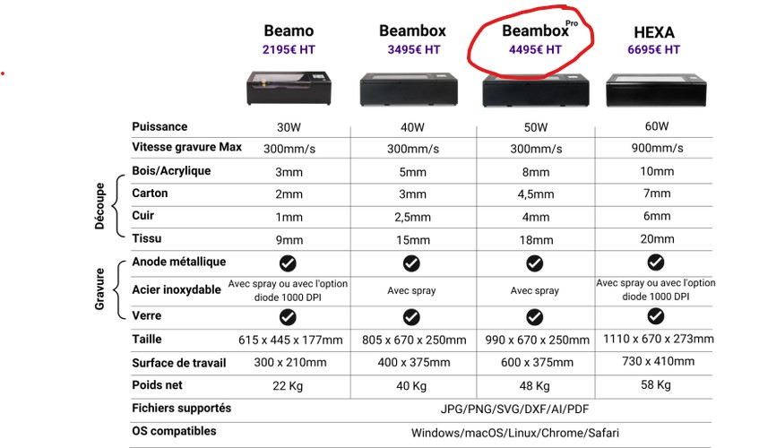

# Introduction_Laser_Beambox

Small introduction on how to use the Beambox pro laser cutter.

La machine se trouve dans l'atelier bois.

[fiche produit](https://www.fluxlasers.com/beambox-pro.html)

[Logiciel gratuit pour préparer vos fichiers](https://www.fluxlasers.com/service/downloads/) : préférez la version stable en téléchargement.

La beambox pro est une découpeuse laser de table qui est destinée à être utilisée à terme en autonomie si les quelques règles décrites ci-après sont suivies.

**Pour une première utilisation et en cas de doute : demandez l'avis d'un membre de l'atelier maquette ou de l'atelier numérique **

Elle dispose d'une surface de travail de 600 x 375 mm et en autonomie elle est destinée à procéder à des gravures et découpes de : 
- contreplaqué / mdf - 3mm
- acrylique - 3mm
- carton plume - 3mm
- carton bois - 3mm
- carton gris - 2mm

En dehors de ces matériaux (y compris à des épaisseurs différentes) vous demander de l'aide à un membre de l'atelier maquette ou de l'atelier numérique.

Pour information, vous pouvez trouver ci-dessous le tableau des capacités de la machine en terme de matériaux en découpe et gravure.

