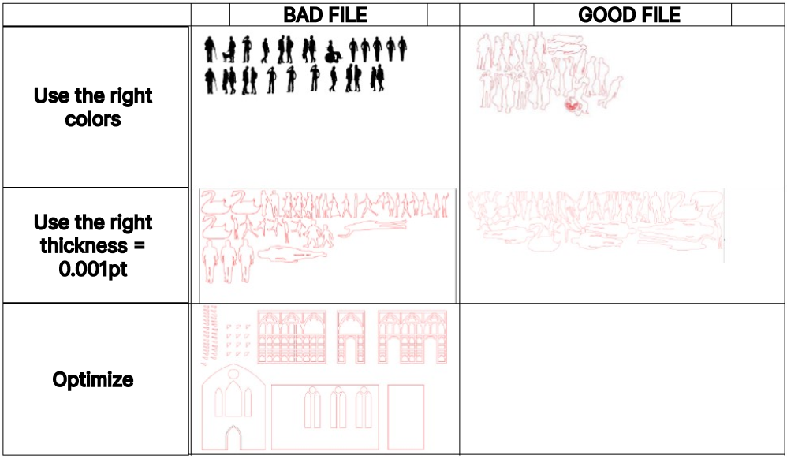
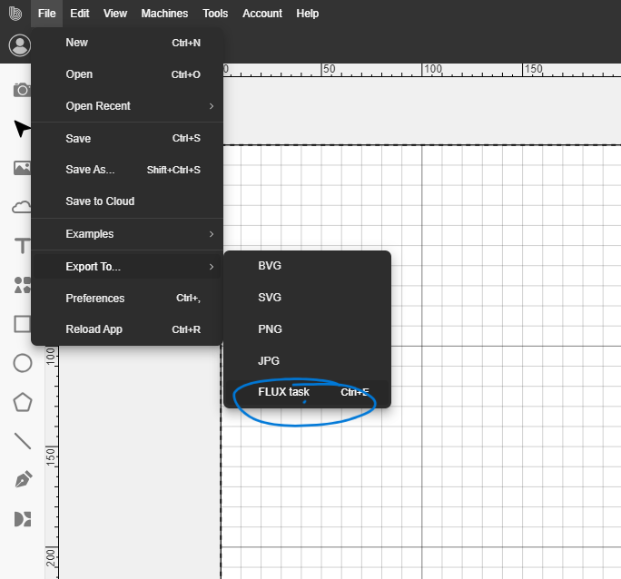

# Introduction_Laser_Beambox

<!-- vscode-markdown-toc -->
* 1- [The paths](#Thepaths)
* 2- [The BeamStudio software (only for beambox)](#TheBeamStudiosoftwareonlyforbeambox)
* 3- [Getting started with the machine](#Gettingstartedwiththemachine)
* 4- [Material tests](#Materialtests)
	* 4.1. [PMMA](#PMMA)
	* 4.2. [Wood cardboard](#Woodcardboard)
	* 4.3. [Foam cardboard](#Foamcardboard)
	* 4.4. [Gray cardboard](#Graycardboard)
	* 4.5. [MDF](#MDF)
* 5- [Ressources for paths](#Ressourcesforpaths)
* 6- [But how does it really work ?](#Buthowdoesitreallywork)

<!-- vscode-markdown-toc-config
	numbering=true
	autoSave=true
	/vscode-markdown-toc-config -->
<!-- /vscode-markdown-toc -->

Small introduction on how to use the Beambox pro laser cutter.

The machine is available in the woodworking lab.

[Product sheet](https://www.fluxlasers.com/beambox-pro.html)

**[Free software to prepare your files](https://www.fluxlasers.com/service/downloads/)** : please prefer the stable version in downloads.

The beambox pro is a laser cutter that is intended to be used in autonomy by students if the following rules are followed.

** for a first use and in case of doubt : ask someone from the digital workshop or the modelling workshop**

The beambox has a working surface of **600 x 350 mm** and is intended to proceed to cuts and engraving of :
- wood sheet / mdf - 3mm
- acrylic - 3mm
- foam cardboard - 3mm
- wood cardboard - 3mm

Appart from the aformoentionned materials (including other thicknesses) you will need to ask someone from the modeling workshop or the digital workshop.

FYI you can check the table below for the beambox pro in terms of cutting and engraving capabilities.

You can find the full documentation from the manufacturer **[here](https://support.flux3dp.com/hc/en-us/categories/360000121176-Beambox-Guide)**

or as a  **[pdf](lasets_assets/beambox-manual.pdf)**

# Le workflow

First you need to prepare your files with a vectorial drawing tool (inkscape, illustrator or any other) - instructions below. The software can assist you in the preparation of your files.(but your files won't be compatible with the other laser cutters)

If you want a bigger size than the beambox supports, you can send your file to the maquette studio *atelier@lecolededesign.com* who will handle it

Then you can use the BeamStudio software and import your paths. You will then be able to choose which traces you want to cut and which you want to engrave.

Finally you can save your project and transfer it to the computer connected to the laser to open it and launch the cut on the machine. **For a first use of the machine ask for help**

##  1. The paths

Because of compatibility with the other laser cutters, it is recommended to follow the maquette workshop procedure. This procedure is valid whatever the machine you use.

Prepare your files with illustrator
- size of the page in the format of the machine (500 x 350 mm)
- Choose RVB mode : Files -> Document Colorimetry -> RVB
- Draw the contour of the workin area with a thickness of 0.01mm in color YELLOW (255,255,0) => optional for the beambox pro.
- Place your paths in the working area.
- Color settings for your paths
    - Cutting in RED (255,0,0) : empty fill / red stroke / thickness 0.01pt.
    - Engrave in BLACK (0,0,0) : empty fill / black stroke 
- **Optimize your files** to avoid waste and limit cutting time
- **Group** your paths
    - in the upper left corner.
    - you can space them only by 1mm between each other.
- Save as a **.pdf** (Acrobat 8) - for the beambox you can also save as a **.svg** file specifically if the import pdf doesn't work.

##  2. The BeamStudio software (only for beambox)

The software is very easy to use, you can find a full guide **[here](https://support.flux3dp.com/hc/en-us/categories/360000121176-Beambox-Guide)**

The UI looks like this 

You can import files by dragging and dropping them

Be sure to set the dimensions of the working area by going in the **Edit** menu -> **Document and settings** and be sure to select **Beambox pro** in the **working area** menu.

If you have several paths for cutting and engraving you can select the **"color"** option - each color in the original path will be parsed into a specific layer. 
Otherwise you can choose **"single layer"** to have all your paths in one layer.

You can then move your paths, resize them, and eventually add some elements (images, texts etc) 

In the upper right corner you have a menu that will help you adjust properties of your paths.

Or works with your layers

For each layer you have the opportunity to choose a specific speed and power for the laser. You can have one layer for cuttin and one layer for engraving.

##  3. Getting started with the machine

##  3. Chargement des matériaux et lancement de la découpe

The way to go is to launch the job directly from the machine. You'll need a usb key for that.

1- Export your design as a  "Flux Task"

2- Place the exported file on a usb key and connect it to the machine (usb on the right of the screen)

3- Press the start button, the choose the usb key and the file containing your exported job 

4- Choose the origin of your job by clicking the target icon. 

5- This will open up a camera view where you'll be able to align the green cross with the upper left corner of your material.

6- Once it's done click "OK" and the click "START" to actually begin the job.

 How to launch from the beam studio software (obsolete) 

Once the machine has been started and you file loaded on the computer connected to the machine, you can click on the play button to start the job :

Once you click the following window will open. It is about setting the starting point (origin) of the job. You have to align the origin of the machine to the **upper left corner** of your material.

Click the target icon:

You can now move the green lines so that the align with the upper left corner of the material.

 

##  4. Material tests

You can find a box with all the tests next to the machine in the modelling workshop.

###  4.1. PMMA
 

###  4.2. Wood cardboard
 

###  4.3. Foam cardboard
 

###  4.4. Gray cardboard
 

###  4.5. MDF
 

##  5. Ressources for paths

[Many ressources (in french)](https://leresteux.net/creation-de-boite-a-la-decoupeuse-laser/)

[Box generator](https://www.festi.info/boxes.py/)

[Living hinges svg](https://github.com/b2renger/Introduction_Laser_Beambox/releases/tag/1.1)

[Living hinges ai](https://github.com/b2renger/Introduction_Laser_Beambox/releases/tag/1.0)

##  6. But how does it really work ?

[Going further](https://edutechwiki.unige.ch/fr/D%C3%A9coupe_et_gravure_laser)

